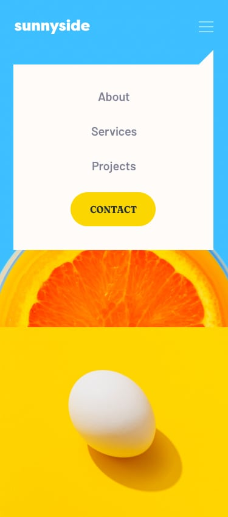

# Frontend Mentor - Sunnyside agency landing page solution

This is a solution to the [Sunnyside agency landing page challenge on Frontend Mentor](https://www.frontendmentor.io/challenges/sunnyside-agency-landing-page-7yVs3B6ef). Frontend Mentor challenges help you improve your coding skills by building realistic projects.

## Table of contents

- [Overview](#overview)
  - [The challenge](#the-challenge)
  - [Screenshot](#screenshot)
  - [Links](#links)
- [My process](#my-process)
  - [Built with](#built-with)
  - [What I learned](#what-i-learned)
  - [Continued development](#continued-development)
- [Author](#author)

## Overview

### The challenge

Users should be able to:

- View the optimal layout for the site depending on their device's screen size
- See hover states for all interactive elements on the page
- Navigate through the mobile menu

### Screenshot




### Links

- Solution URL: [GitHub Repository](https://github.com/devbyroman/Agency-landing-page/tree/main)
- Live Site URL: [Live Demo](https://agency-landing-page-sigma-ten.vercel.app/)

## My process

### Built with

- Semantic HTML5 markup
- SCSS/Sass with 7-1 architecture pattern
- CSS Grid
- Flexbox
- Mobile-first workflow
- Vanilla JavaScript
- Responsive images with `<picture>` element
- Custom CSS properties
- Google Fonts (Barlow & Fraunces)

### What I learned

This project was an excellent opportunity to practice **modern CSS Grid layouts** and **SCSS modular architecture**. I implemented a clean 7-1 pattern separating styles into:

- `abstracts/` - variables, mixins, and functions
- `base/` - reset and typography styles
- `components/` - navigation, buttons, overlays
- `layout/` - grid systems, hero, features, services, testimonials, gallery, footer

**Key learnings:**

#### 1. SCSS Architecture & Mixins

Created reusable mixins for responsive breakpoints:
```scss
@mixin mobile {
@media (max-width: $breakpoint-mobile) {
@content;
}
}

@mixin desktop {
@media (min-width: $breakpoint-desktop) {
@content;
}
}
```

#### 2. Responsive Images with Picture Element

Implemented adaptive images for optimal performance:

<picture> <source media="(min-width: 1025px)" srcset="images/desktop/image-transform.jpg">  </picture> 
This approach:

Loads mobile-optimized images on smaller screens

Serves desktop images only when needed

Improves page load performance

Reduces bandwidth usage on mobile devices

3. CSS Grid for Complex Layouts
Used CSS Grid for the main layout structure:

```scss
.feature {
  display: grid;
  @include desktop {
    grid-template-columns: 1fr 1fr;
  }
}
4. Mobile Menu Implementation
Built a smooth sliding mobile menu with overlay:

```js
menuToggle.addEventListener('click', () => {
  navList.classList.toggle('active');
  overlay.classList.toggle('active');
});
```
5. Custom Link Underlines
Created animated underline effects for feature links:

```scss
.feature-link {
  &::after {
    content: '';
    position: absolute;
    bottom: -0.25rem;
    background: $yellow-500;
    transition: opacity 0.2s;
  }
  &:hover::after {
    opacity: 1;
  }
}
```
Author

Frontend Mentor - @devbyroman

GitHub - @devbyroman

Installation & Setup
Clone the repository:

git clone https://github.com/devbyroman/sunnyside-agency-landing-page.git
Navigate to the project directory:

cd sunnyside-agency-landing-page
If using SCSS, compile with:

sass styles/main.scss styles/main.css --watch
Open index.html in your browser or use a local server:

Features
✅ Fully responsive design (375px - 1440px)
✅ Mobile menu with smooth animations
✅ Hover states on all interactive elements
✅ Optimized images for different screen sizes
✅ Semantic HTML5 structure
✅ Clean SCSS architecture
✅ Cross-browser compatible
